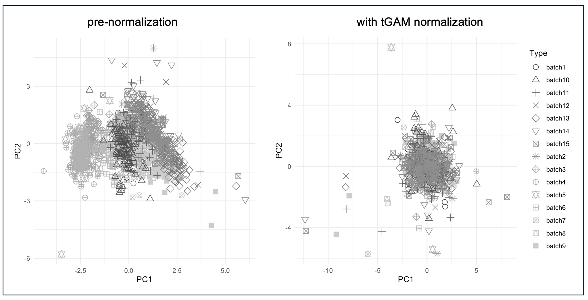

# Metanorm
Metanorm supports robust metabolomics data normalization across scales and experimental designs. The R package implements three robust normalization methods (tGAM, rGAM and rLOESS). tGAM is recommended due to its superior robustness, but rGAM and rLOESS are faster. We further recommend using both QC as well as biological samples for normalization, and to have metanorm check for discrepancies between QC and biological samples. The example usage below demonstrates this recommended approach.

## Troubleshooting

The package has been extensively tested, though use cases differ and unforeseen circumstances may cause unexpected behaviour. If you run into issues, please raise a GitHub issue or contact me directly at matthijs *dot* vynck *at* ugent *dot* be.

## Installing the R package

Make sure `R` (**version >= 4.4.0**) is installed on your computer:

https://cloud.r-project.org/index.html

The package can be installed directly from R as follows:

```r
if (!require("devtools", quietly = TRUE))
    install.packages("devtools")

devtools::install_github("UGent-LIMET/Metanorm")
```

## Example usage of the R package

Load the package:

```r
library(metanorm)
```

An example dataset can be loaded from the package:
```r
load(system.file("extdata", "example.RData", package = "metanorm"))
```


The example dataset contains three objects:
- *rawdata*, a numerical matrix containing the unnormalized data (rows = compounds, columns = samples)
- *batch*, a vector containing for each sample run the batch to which it belongs
- *metanorm.qc*, a vector containing for each sample run whether it is a QC or another type of sample (not a QC)

```r
> rawdata[1, 1:20]
 [1] 16.16302 16.41937 16.34396 16.50563 16.69834 16.59836 16.61340 16.60563 16.59414 16.64206 16.59123 16.53166 16.66316 16.67129 16.69392 16.78451 16.78775 16.72069 16.73120 16.76442
> batch[1:20]
 [1] "batch1" "batch1" "batch1" "batch1" "batch1" "batch1" "batch1" "batch1" "batch1" "batch1" "batch1" "batch1" "batch1" "batch1" "batch1" "batch1" "batch1" "batch1" "batch1" "batch1"
> metanorm.qc[1:20]
 [1] "QC"     "QC"     "sample" "sample" "sample" "sample" "sample" "sample" "sample" "sample" "sample" "sample" "QC"     "sample" "sample" "sample" "sample" "sample" "sample" "sample"
```

Normalizing the data is achieved by calling the *metanorm* function.
```r
# normalize the first 5 compounds in the example dataset using the (default) tGAM method
normdat <- metanorm(rawdata[1:5,],       # numerical data matrix to normalize
	                model = "tGAM",      # default tGAM method
                    type = metanorm.qc,  # vector with sample types, i.e. "QC"
                                         #   and other sample types
                    QCcheck = TRUE,      # check whether QCs are representative
                    batch = batch,       # normalize by batch
                    plotdir = "~/Documents/metanormExample/")  # generate plots for
                                                               #   diagnostics
```

We can generate a PC score plot to see whether batch effects have diminished:
```r
# make a PC score plot of the data before and after normalization, label by batch
plotPCA(rawdata[1:5,], type = batch)
plotPCA(normdat[1:5,], type = batch)
```




Individual compound pre- vs. post-normalization intensity vs. order plots can be retrieved from the *plotdir* directory. These allow finegrained assessment of normalization performance. It is highly recommended to look at a decent number of these plots to judge normalization performance.

To see why this is important, you can now normalize with QC-RLSC, using, as prescribed, QC samples for normalization (*QConly* argument):

```r
# normalize the first 5 compounds in the example dataset, this time using QC-RLSC
normdat2 <- metanorm(rawdata[1:5,],       # numerical data matrix to normalize
                     model = "QC-RLSC",   # use QC-RLSC
                     type = metanorm.qc,  # vector with sample types, i.e. "QC"
                                          #   and other sample types
                     QConly = TRUE,       # QC-RLSC as presecribed uses QC sampls only
                     batch = batch,       # normalize by batch
                     plotdir = "~/Documents/metanormExample2/")  # generate plots for
                                                               #   diagnostics

# make a PC score plot of the data before and after normalization, label by batch
plotPCA(rawdata[1:5,], type = batch)
plotPCA(normdat2, type = batch)
```

While no apparent batch effects remain in the PC score plot, you might want to check the pre- versus post-normalization plot number 4, for example! What does the signal drift look like in the biological samples?